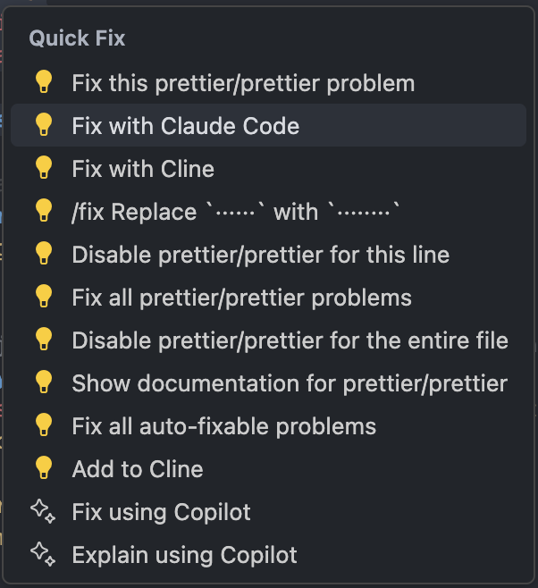

# Change Log

All notable changes to the "Claude Code" extension will be documented in this file.

Check [Keep a Changelog](http://keepachangelog.com/) for recommendations on how to structure this file.

## [0.1.6] - 2025-01-09

### Added
- **Official Claude Code Extension Integration**: NEW feature to detect and use the official Claude Code extension (anthropic.claude-code) when available
  - Automatic detection and smart fallback from official extension to terminal approach  
  - Zero breaking changes - existing terminal functionality preserved as fallback
  - Seamless user experience with no configuration required
- **Enhanced Terminal Connection Strategy**: Intelligent terminal management and connection
  - Smart terminal creation and disposal when official extension is detected
  - Improved connection reliability with better error handling
  - Single terminal approach prevents duplicate terminals

### Improved
- **Launch Strategy**: Unified launch logic for both auto-start and manual launch scenarios
- **Error Handling**: Enhanced error handling mechanisms throughout the extension
- **Performance**: Better resource management and terminal lifecycle handling

### Technical
- Added test infrastructure improvements (test dependencies updated)
- Code quality improvements with enhanced linting and compilation

## [0.1.3] - 2025-05-31

### Added
- **Quick Fix Integration**: "Fix with Claude Code" option in VSCode's Quick Fix menu (Ctrl+. / Cmd+.)
  - Automatically appears when errors or warnings are detected in code
  - Sends comprehensive error context including file references, line numbers, error messages, and surrounding code
  - Integrated with VSCode's diagnostic system for seamless debugging workflow
  - Supports paste detection to show "[Pasted text #X +Y lines]" in Claude Code terminal

### Improved
- **Terminal Input**: Refactored to use smart paste detection for all text sending operations
  - Automatically determines when to use paste mode based on content (multi-line, >100 chars, code blocks)
  - Consistent behavior across all input methods (manual typing, Quick Fix, drag & drop)
  - Better integration with Claude Code's paste detection system

## [0.1.2] - 2025-05-30

### Fixed
- **VSCode Compatibility**: Lowered minimum VSCode version requirement from 1.100.0 to 1.90.0 for better compatibility with older VSCode installations
- Resolves installation error for users with VSCode versions 1.90.0 - 1.99.x

## [0.1.1] - 2025-05-30

### Added
- **Terminal Detection**: Automatic detection and connection to existing Claude Code terminal sessions
  - Seamlessly connects to running Claude instances without disrupting workflow
  - Intelligent process detection across different platforms (macOS, Linux, Windows)
  - Validates terminal responsiveness before attempting connection
  - Displays connection status with informative UI banners
- **Enhanced Drag and Drop**: Comprehensive multi-source file and image support
  - Support for VSCode Explorer files and folders with proper URI parsing
  - External file manager support (Finder, Windows Explorer) with path resolution
  - Image handling with automatic temporary file creation for Claude Code CLI
  - Visual feedback during drag operations with dashed outlines
  - Proper relative/absolute path resolution based on workspace context

### Improved
- **Terminal Visibility**: Enhanced terminal management and user experience
  - Terminal automatically shows when sending messages while preserving input focus
  - Better terminal lifecycle management with proper cleanup
  - Improved connection status feedback with contextual messages
- **Message Processing**: Unified message handling system
  - Streamlined image and problem processing workflow
  - Better organization of message sending logic
  - Enhanced error handling and validation
- **UI Experience**: Multiple interface improvements
  - Cleaner path display in context menus without redundant slashes
  - Better visual feedback for drag and drop operations
  - Improved input field behavior and focus management

### Fixed
- **Path Resolution**: Corrected file path construction to remove leading slash for proper relative paths
- **Image Processing**: Fixed critical image handling to ensure all images are saved to temporary files before sending to Claude Code CLI
- **Focus Management**: Improved input field focus restoration after terminal operations
- **Process Detection**: Enhanced reliability of Claude Code process detection across different terminal types

## [0.0.9] - 2025-05-27

### Improved
- **Quote Functionality**: Enhanced code reference functionality for cleaner chat experience
  - Changed format from @file:line with full code blocks to compact file#L19-29 format
  - Reduces noise in chat by eliminating redundant code content
  - Uses GitHub-style line reference format for better readability
  - Updated addSelectionToInput command to send compact file references with '@' prefix

### Fixed
- **Message Sending Logic**: Improved message handling and unified image/problem processing
  - Better organization of message sending workflow
  - Enhanced unification of image and problem handling logic
  - Improved overall message processing reliability

## [0.0.8] - 2025-05-23

### Fixed
- **Image Attachment Formatting**: Fixed conditional logic in image manager for proper formatting of single vs multiple image attachments
- **Claude Code Input**: Eliminated duplicate image listings when sending images to Claude Code terminal

## [0.0.7] - 2025-05-22

### Added
- **Interactive Problem Selection UI**: Added sophisticated problem selection interface with preview functionality for easier debugging workflow
- **Line Number Information**: Enhanced code selections now include precise line number information for better context sharing
- **Problem Selector with Preview**: Visual problem browser with code preview to quickly identify and share relevant issues with Claude

### Enhanced
- **Developer Experience**: Improved problem navigation and code sharing workflows
- **Context Accuracy**: Better precision in code location sharing through line number integration
- **UI/UX**: More intuitive problem selection interface with visual previews

## [0.0.6] - 2025-05-21

### Added
- **Context Menu Integration**: Added "Add to Claude Code Input" option to editor context menu for selected code
- **VSCode Problems Integration**: Direct integration with VSCode's problems panel for enhanced error handling and reporting
- **Selection-to-Input**: Seamlessly add selected code snippets directly to Claude Code input for analysis

### Enhanced
- **Developer Workflow**: Improved integration with VSCode's native features for a more streamlined coding experience
- **Code Analysis**: Better support for sharing selected code segments with Claude for targeted assistance

## [0.0.5] - 2025-05-21

### Fixed
- **Input Field Scrolling**: Fixed issue where long file paths would create unwanted horizontal scrollbars in the input field
- **Text Wrapping**: Improved text wrapping behavior so long content wraps to new lines instead of extending beyond the visible area
- **Visual Consistency**: Enhanced input field display for better readability with long file names and paths

## [0.0.4] - 2025-05-21

### Added
- **Async Terminal Communication**: Enhanced terminal communication with proper async support
- **Exit Command Integration**: Improved session management with proper exit command handling
- **Custom Slash Commands**: Full support for custom slash commands with configuration
  - Slash command suggestions and auto-completion
  - Custom command service for extensible functionality
  - Documentation for custom slash commands usage

### Fixed
- **Input Field UI**: Fixed input field behavior and scrolling for better usability
- **Input Field Cropping**: Resolved UI cropping issues with the input field
- **TypeScript Errors**: Removed unused imports causing compilation errors
- **Slash Command Duplication**: Fixed duplication of custom slash commands in menu UI

### Changed
- **Terminal Session Management**: Improved restart functionality with proper session continuity
- **UI Responsiveness**: Enhanced input field behavior and user interaction
- **Code Quality**: Cleaned up imports and resolved TypeScript issues

### Documentation
- **Custom Slash Commands Guide**: Added comprehensive documentation for creating and using custom slash commands
- **README Updates**: Improved documentation with better examples and usage instructions

## [0.0.3] - 2025-05-20

### Added
- Enhanced drag and drop functionality with improved user interface
- Comprehensive file handling for both VSCode Explorer and external sources
- Visual feedback during drag operations
- Better handling of image files with proper preview functionality
- Support for multiple file types from various sources
- Proper path resolution for relative/absolute paths
- Terminal visibility improvements
- Custom slash commands support with configuration
- Documentation for custom slash commands usage

### Changed
- Updated restart button to properly exit current Claude session with `/exit` command and start a new one with the `-c` flag to continue the previous session
- Improved session continuity between restarts

## [0.0.2] - 2025-05-20

### Added
- Updated README with new images and improved layout
- Show terminal in the background before sending text to preserve focus
- Update image button to use SVG icon and adjust styles for better integration

## [0.0.1] - 2025-05-19

### Added
- Initial release of Claude Code VSCode Extension
- Interactive chat interface with Claude Code
- Terminal input webview in sidebar
- Support for images (drag & drop, paste, file selection)
- @mentions for workspace problems and terminal output
- Slash commands for quick access to Claude features
- Session persistence within VSCode
- Auto-start Claude process on activation
- Restart command for Claude process
- Markdown rendering with syntax highlighting
- Copy code and text from responses
- Clear conversation functionality

### Features
- Launch Claude Code terminal from command palette or sidebar
- Persistent conversation history during VSCode session
- Real-time status indicators for Claude process state
- Error handling and automatic recovery
- Support for multiple image formats (JPG, PNG, GIF, WebP, SVG)
- Context-aware mentions for problems and terminal output

### Known Issues
- Session history is not persisted after VSCode restart
- Full workspace context sharing is still in development