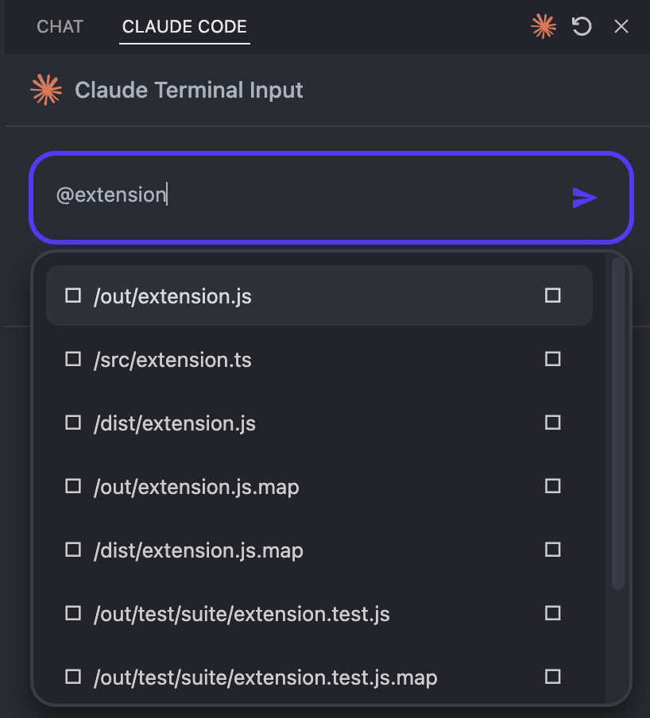
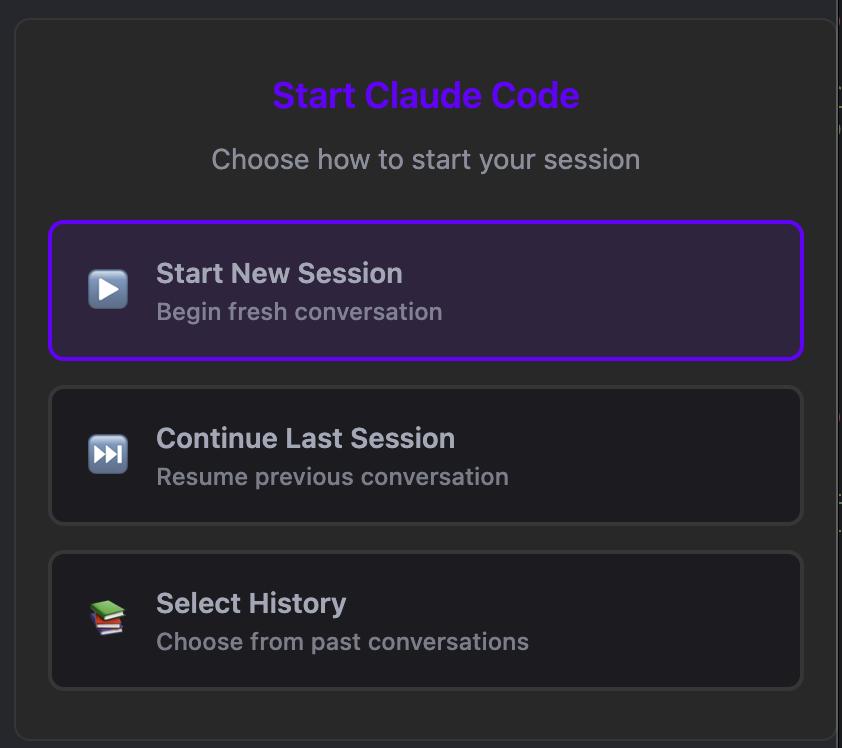
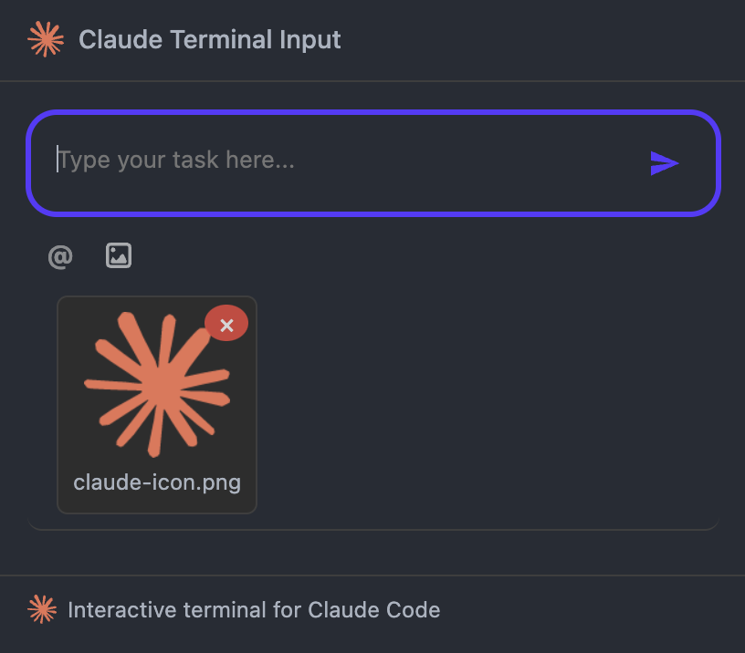
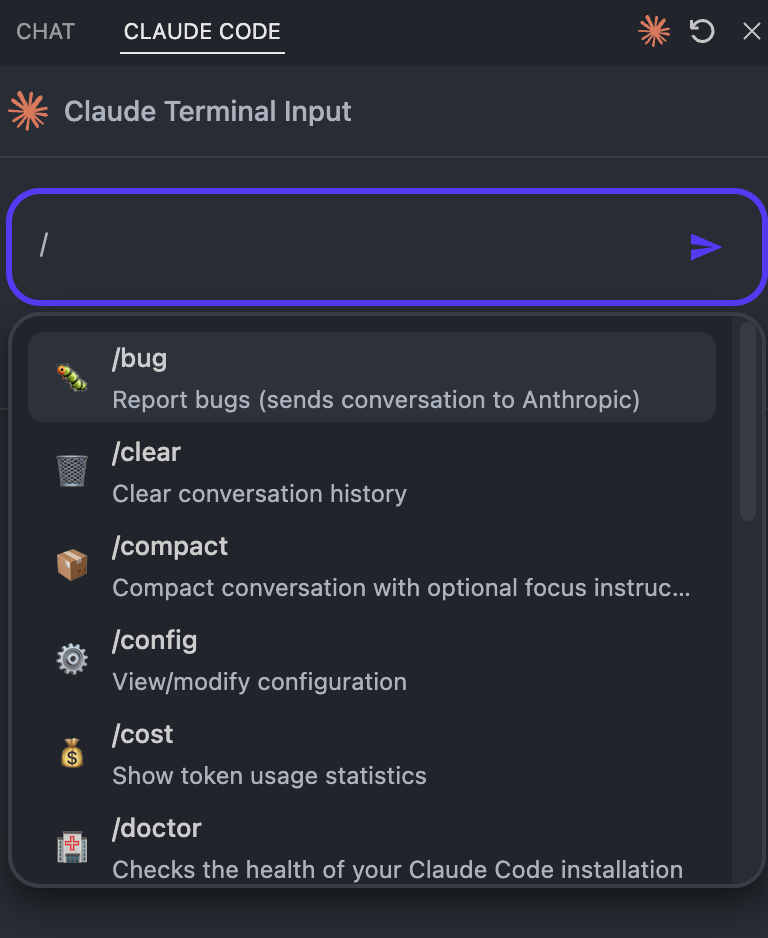
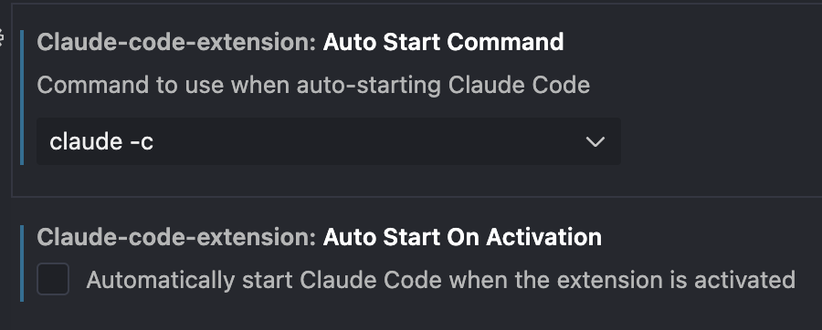

# Claude Code Assistant for VSCode

<div align="center">
  
</div>

*Unofficial integration* of Anthropic's Claude Code AI assistant into Visual Studio Code. Get intelligent coding assistance without leaving your editor.

> **Disclaimer**: This is an unofficial extension not affiliated with Anthropic. It integrates with the official Claude Code CLI tool which must be installed separately.

## Features

### 🤖 AI-Powered Coding Assistant
- **Seamless Integration**: Access Claude Code directly from VSCode's sidebar
- **Smart Launch Options**: Choose how to start your Claude session
- **Auto-Start Control**: Configure automatic startup behavior
- **Persistent Sessions**: Maintain conversations across your coding sessions
- **Context-Aware**: Claude understands your workspace and current files

<div align="center">
  
</div>

### 🚀 Smart Session Management
- **Launch Options**: When Claude isn't running, choose from three convenient options:
  - **Start New Session**: Begin a fresh conversation
  - **Continue Last Session**: Resume your previous conversation
  - **Select History**: Browse and choose from past conversations
- **Auto-Start Configuration**: Control whether Claude starts automatically when VSCode opens
- **Flexible Commands**: Configure which command to use for auto-start (claude, claude -c, etc.)

<div align="center">
  
</div>

### 🖼️ Visual Context Support
- **Drag & Drop Images**: Simply drag images into the chat
- **Paste Screenshots**: Ctrl/Cmd+V to paste images directly
- **File Selection**: Use the image button to browse and attach files
- **Multiple Formats**: Supports JPG, PNG, GIF, WebP, and SVG

<div align="center">
  
</div>

### 🚀 Quick Fix Integration
- **Instant Error Help**: "Fix with Claude Code" appears in VSCode's Quick Fix menu (Ctrl+. / Cmd+.)
- **Automatic Context**: Sends error details, file references, and surrounding code automatically
- **Seamless Workflow**: Click the lightbulb on any error to get Claude's assistance instantly
- **Smart Detection**: Works with all types of errors and warnings from any language

<div align="center">
  
</div>

### 💬 Smart Interactions
- **@mentions**: Reference workspace problems and terminal output
- **Slash Commands**: Quick access to Claude's powerful features
- **Custom Commands**: Create your own project and user slash commands
- **Markdown Support**: Rich formatting with syntax highlighting
- **Code Actions**: Copy code blocks with one click

<div align="center">
  
</div>

### 🎨 Beautiful Interface
- **Claude-Styled UI**: Familiar interface matching Claude's design
- **Dark/Light Theme**: Adapts to your VSCode theme
- **Status Indicators**: Real-time feedback on Claude's state
- **Clear History**: Easy conversation management

## Prerequisites

- Visual Studio Code 1.70.0 or newer
- [Claude Code CLI](https://docs.anthropic.com/claude/docs/claude-code) installed on your system
- Active Claude account with authentication

## Building the Extension

To build the extension, follow these steps:

1. Install dependencies:
   ```
   npm install
   ```

2. Build the extension:
   ```
   npm run build
   ```

This will generate a .vsix file in the project root directory.

## Installing the Extension

### From the VSIX file

1. Open VSCode
2. Go to the Extensions view
3. Click the "..." menu (top-right of Extensions view)
4. Select "Install from VSIX..."
5. Browse to the .vsix file generated in the build step
6. Select the file and click "Install"

### From the Command Line

You can also install the extension using the VSCode CLI:

```
code --install-extension claude-code-extension-0.0.1.vsix
```

## Getting Started

1. Install the extension from the VSCode Marketplace
2. Open the Claude Code panel from the sidebar (look for the Claude icon)
3. Choose how to launch Claude:
   - **Auto-start enabled**: Claude starts automatically when VSCode opens
   - **Auto-start disabled**: Select from launch options (New Session, Continue Last, or Select History)
4. Start chatting with Claude about your code!

## Usage

### 🚀 Launch Options
When Claude isn't running, you'll see three launch options:
- **Start New Session** (▶️): Begin a fresh conversation with Claude
- **Continue Last Session** (⏭️): Resume your previous conversation where you left off
- **Select History** (📚): Browse and choose from your past conversations

### 💬 Basic Chat
- Type your questions or requests in the input area
- Press Enter or click Send to submit
- Claude will respond with helpful suggestions and code

### 🚀 Quick Fix with Claude
- **Instant Help**: When you see a red/yellow squiggly line under code, press Ctrl+. (Cmd+. on Mac)
- **Select Fix**: Choose "Fix with Claude Code" from the Quick Fix menu
- **Auto Context**: Claude receives the error details, file location, and surrounding code automatically
- **Get Solution**: Claude analyzes the error and provides targeted fixes

### 🖼️ Working with Images
- **Drag & Drop**: Drag image files directly onto the input area
- **Paste**: Copy an image and paste with Ctrl/Cmd+V 
- **Browse**: Click the 📎 button to select image files
- Supported: JPG, PNG, GIF, WebP, SVG

### 🔧 Advanced Features
- **@mentions**: Type @ to reference problems or terminal output
- **Slash Commands**: Type / to see available commands
- **Custom Commands**: Create your own project-specific (`/project:command`) and personal (`/user:command`) slash commands
- **Clear Chat**: Click the clear button to start fresh
- **Restart Claude**: Use the restart button if needed

### ⚙️ Configuration
The extension can be customized through VSCode settings:

- **Auto Start On Activation**: Enable/disable automatic Claude startup when VSCode opens
- **Auto Start Command**: Configure which command to use when auto-starting Claude
  - `claude` - Start a new session
  - `claude -c` - Continue the last session
  - `claude -r` - Select from conversation history
  - Custom commands as needed

<div align="center">
  
</div>

Access these settings through VSCode preferences: `File > Preferences > Settings` and search for "Claude Code Extension".

See our [documentation](https://github.com/codeflow-studio/claude-code-chat/tree/main/docs) for detailed guides, including [how to create custom slash commands](docs/custom-slash-commands.md).

## Development

- `npm run compile` - Compile the extension
- `npm run watch` - Watch for changes and recompile
- `npm run package` - Package the extension for production (webpack)
- `npm run lint` - Run ESLint on source files
- `npm run test` - Run tests
- `npm run vsix` - Create VSIX package for installation

## Support

- 📖 [Documentation](https://github.com/codeflow-studio/claude-code-chat/tree/main/docs)
- 🐛 [Report Issues](https://github.com/codeflow-studio/claude-code-chat/issues)
- 💬 [Discussions](https://github.com/codeflow-studio/claude-code-chat/discussions)

## License

MIT License - see [LICENSE.md](LICENSE.md) for details

## Contributing

We welcome contributions! Please see our [Contributing Guide](CONTRIBUTING.md) for details.

---

Made with ❤️ by [CodeFlow Studio](https://github.com/codeflow-studio)

*This is an unofficial extension. Claude and Claude Code are trademarks of Anthropic, PBC.*